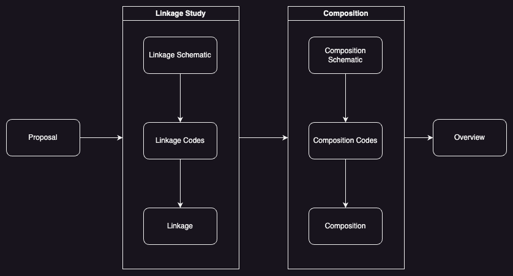

# RumeLab

Welcome to RumeLab.

RumeLab aims to produce electronic devices.
This GitHub organisation contains all the results of research, ranging from examples and schematic diagrams to libraries.

## Repository naming convention

The repository under RumeLab follows a simple naming convention to make the purpose of the repository explicit.
Table 1 is the naming suffix and its corresponding description.

_Table 1: Naming suffix_

| Suffix                    | Description                                                                             |
| ------------------------- | --------------------------------------------------------------------------------------- |
| `*_proposal`              | A proposal to develop an electronic device for a certain problem statement.             |
| `*_linkage_schematic`     | Schematic diagram for linkage study.                                                    |
| `*_linkage_code`          | Code for a programmable device in linkage study.                                        |
| `*_linkage`               | A documentation pertaining to studies of interaction between two electronic components. |
| `*_composition_schematic` | Schematic diagram for composition.                                                      |
| `*_composition_code`      | Code for a programmable device in linkage study.                                        |
| `*_composition`           | Documentation pertaining to studies of different linkages composed into one system.     |
| `*_overview`              | An overview pertaining to the development.                                              |

## Development lifecycle

The RumeLab development lifecycle includes 4 steps: proposal, linkage studies, composition, and overview, as illustrated in Figure 1.

Figure 1: RumeLab Development Lifecycle

The proposal is used to define the problem statement and the suggested electronic solution.
The proposal would need to include:

- Problem statement;
- Proposed solution;
  - Primitive functionalities; and
  - Suggested electronic components.

The problem statement section describes the aim or goal to be achieved through developing the electronic device.
The proposed solution section describes the overview of the proposed electronic device.
The primitive functionalities section describes the basic functionalities to yield the behaviour of the proposed electronic device.
The suggested electronic components section describes the suggested electronic components that satisfy the primitive functionalities in detail, such as the retail price, datasheet, and examples.

After completing the proposal, linkage studies are done to study the interaction between the suggested electronic components.
It is usually the interaction between the microprocessor as the master device and slave devices.
Linkage schematics are schematic diagrams that describe sample pin connections with pin requirements to correctly and optimally initiate the desired interaction between the two components.
Linkage codes are sample codes for the programmable microprocessors in the corresponding linkage schematics.
A linkage repository will be created to document the overview of the linkage studies.

After the required interactions between the components are tested with linkage studies, composition is done to put together all the electronics.
Composition schematics are schematic diagrams that include all the necessary components and connections to achieve the behaviour of the stated solution in the proposal.
Composition codes are codes for the programmable microprocessors in the corresponding composition schematics.
A composition repository will be created to document the overview of the composition.

Overviews are written to document the overview of the lifecycle, from proposal to composition.
